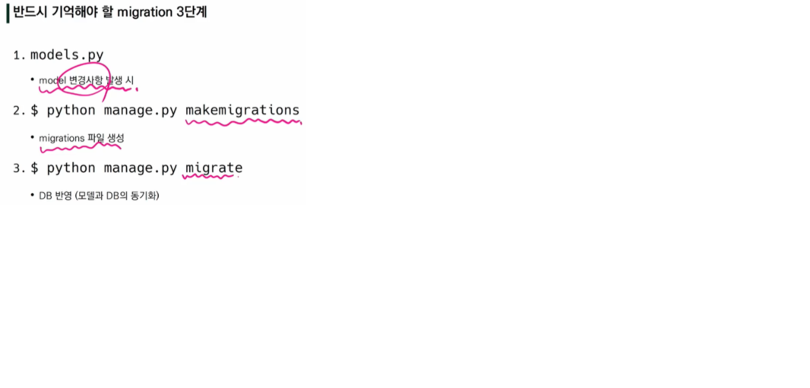

# Django Model

> Model

- 단일한 데이터에 대한 정보를 가짐
  - 사용자가 저장하는 데이터들의 필수적인 필드들과 동작들을 포함
- Django는 model을 통해 데이터에 접속하고 관리
- 일반적으로 각각의 model은 하나의 DB 테이블에 매핑됨

> Database

- 체계화된 데이터의 모임
- 쿼리(Query)
  - 데이터를 조회하기 위한 명령어
  - "쿼리를 날린다." --> db를 조작한다.

> DB의 기본 구조

- 스키마(Schema)
  - 데이터베이스에서 자료의 구조, 표현방법, 관계 등을 정의한 구조
- 테이블
  - 열: column, 필드, 속성
  - 행: row, 레코드, 튜플

> Model 정리

* 웹 애플리케이션의 데이터를 **구조화**하고 **조작**하기 위한 도구


> ORM

- Object - Relational - Mapping
- 객체지향 프로그래밍 언어(python)를 사용하여 호환되지 않는 유형의 시스템 간(Django-SQL)에 데이터를 변환하는 프로그래밍 기술
- 번역기
- **생산성**이 워낙 좋아 현대에 많이 쓰임
- DB를 객체(object)로 조작하기 위해 ORM 사용


> models.py 작성

```python
# articles/models.py

class Article(models.Model):
    title = models.CharField(max_length=10)
    content = models.TextField()
    
```

- id는 작성하지 않는다. 장고가 알아서 작성해줌

## Migrations

> Migrations

- Django가 model에 생긴 변화를 반영하는 방법
- 명령어
  - **makemigrations** : 설계도 그리기 
    - `$ python manage.py makemigrations`
  - **migrate** : 반영시키기
    - `$ python manage.py migrate`
  - sqlmigrate : sql로는 어떻게 보이는지
  - showmigrations : 설계도 상태 확인



## Database API

- **그래서 어떻게 소통할건데?**

> DB API

- `Article.objects.all()` : Class name - Manager - QuerySet API
  - QuerySet : 데이터베이스로부터 전달 바은 객체 목록

## CRUD

> Create

- save()

> Read

- all()
- get()
- filter()

> Update

- pk

> Delete

- delete()

## Django Form Class

- 사용자가 입력한 데이터를 검증: `유효성 검증`

> Django's forms

- 외부의 악의적 공격 및 데이터 손상에 대한 **방어 수단**
- Form Class 작성해야함
  - Form내 field, field 배치, 디스플레이 widget, label, 초기값, 유효하지 않는 field에 관련된 에러 메세지 결정

> Form 선언하기

````python
# forms.py
from django import forms

class ArticleForm(forms.Form):
    title = forms.CharField(max_length=10)
    content = forms.CharField(widget=forms.Textarea)
    
````

```python
# views.py
from .froms import ArticleForm

def new(request):
    form = ArticleForm()
    context = {
        'form': form,
    }
    return render(request, 'articels/new.html', context)
```

```python
# new.html
...
<form ...>
	
	{{ form.as_p }}
</form>
...
```

> Form rendering options

1. as_p()
2. as_ul()
3. as_table()

> Django의 HTML input 요소(CharField, TextField,,,) 표현 방법 2가지

1. Form fields
   - 템플릿에서 직접 사용
2. Widgets
   - 웹 페이지의 HTML input 요소 렌더링
   - 반드시 Form fields에 할당

## ModelForm

- Model 필드를 재정의하는 행위가 중복 될 수 있음
- 그래서 장고가 ModelForm이라는 Helper 제공

> ModelForm 선언하기

```python
# forms.py
from django import forms
from .models import Article

class ArticleForm(forms.ModelForm):

	class Meta:
		model = Article
		fields = '__all__'
        # exclude = ('title', )
```

> Meta class

- Model의 정보를 작성하는 곳
- ModelForm을 사용할 경우 사용할 모델이 있어야 하는데 Meta Class가 이를 구성

- `ModelForm` -> 회원가입, `Form` -> 로그인 / 둘은 역할이 다름, 누가 더 나은게 아님

> ModelForm이 쉽게 해주는 것

1. 모델 필드 속성에 맞는 html element를 만들어 주고
2. 이를 통해 받은 데이터를 view 함수에서 유효성 검사를 할 수 있도록 함
