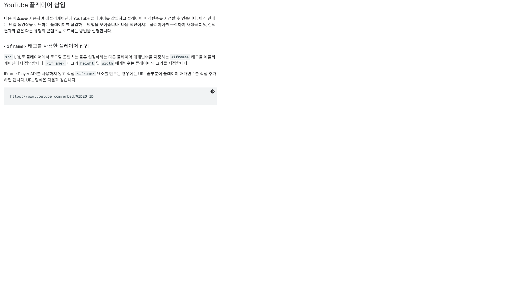

# youtube-project

## 1. 프로젝트 생성
- `vue create youtubd-project`

## 2. theSearchBar.vue 생성
- `TheSearchBar` component 생성
  - component 등록 3단계
    1. import => `from '@/components/...'` 여기 @는 절대경로를 뜻한다. (src아래)
    2. register
    3. print

- TheSearchBar.vue에서 input 태크 생성후, mothods 등록해서 연결
- app.vue 로 emit event 설정
```html
<search-bar @input-change="onInputKeyword"></search-bar>
```
```javascript
methods: {
    onEnter(event) {
        this.$emit('input-change', event.target.value)
    }
}
```

## 3. API_KEY, API_URL 할당
```javascript
methods: {
    onInputKeyword(inputValue) {
        this.inputKeyword = inputValue

        const params = {
        key: API_KEY,
        part: 'snippet',
        type: 'video',
        q: this.inputKeyword
        }
        axios({
        method: 'get',
        url: API_URL,
        params,
        })
        .then(res => {
            console.log(res)
            this.videos = res.data.items
        })
        .catch(err => {
            console.log(err)
        })
    }
}
```

## 4. videoList.vue 생성
- App.vue에서 videos data를 videoList.vue로 props 보냄
```html
<video-list :videos="videos"></video-list>
```
- videoList.vue 의 template에 li로 v-for 돌려서 video 한개의 객체를 읽을 수 있게 만듬
```html
<li
    v-for="video in videos"
    :key="video.id.videoId" key값도 같이 가져옴.
>{{ video.snippet.title }}</li>
```

## 5. VideoListItem.vue 생성
- VideoList의 객체들이 나타날 VideoListItem
- 썸네일과 제목 표시
```html
  <div>
    
    {{ video.snippet.title }}
  </div>
```

## 6. VideoDetail.vue 생성
- App.vue에서 VideoDetail.vue에 클릭한 비디오 신호 받은걸 보내줌
```html
<video-list :videos="videos" @select-video="onSelectVideo"></video-list>
```
- 아래 설명 처럼 iframe 사용

```javascript

computed: {
    videoURI() {
        const videoId = this.video.id.videoId
        return `https://www.youtube.com/embed/${videoId}`
    }
}
```